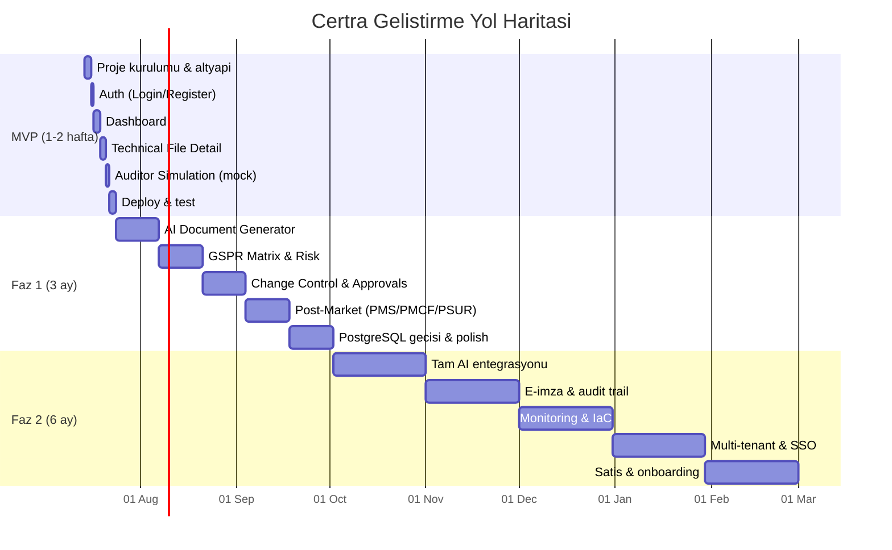

# Certra — Kapsamli Gelistirme Plani (MVP / Faz 1 / Faz 2)

> MDR/IVDR teknik dosya hazirlamaya odakli, AI-yerlesik regulasyon dokumantasyon ve takip platformu.
> TUBİTAK 1812 BiGG — Teknopark Istanbul CUBE Incubation

---

## User Review Required

> [!IMPORTANT]
> **MVP Suresi: 1-2 hafta.** Bu plan, MVP'yi 10 is gununde teslim etmeyi hedefliyor. Faz 1 ve Faz 2 detaylari bilgi amaclidir, MVP onceliklidir.

> [!WARNING]
> **NuxtUI Pro lisansi gerekiyor.** NuxtUI Pro ucretli bir urun (bireysel lisans ~$249). Eger lisans alinmak istenmiyorsa, NuxtUI (ucretsiz) + elle yazilmis bilesenlerle devam edebiliriz. Karar ver.

> [!IMPORTANT]
> **SQLite MVP icin yeterli ama Faz 1'de PostgreSQL'e gecis planlanmali.** Drizzle ORM'in dialect degistirmesi tek satirlik bir degisiklik, schema ayni kalir.

---

## Open Questions

> [!IMPORTANT]
> 1. **Marka adi kesinlesti mi?** "Certra" mi kalacak yoksa yeni bir isim mi var? Domain alinmis mi?
> 2. **NuxtUI Pro lisansi var mi?** Yoksa ucretsiz NuxtUI ile devam edelim mi?
> 3. **Hetzner server hazir mi?** Coolify kurulu mu? Yoksa MVP icin Vercel/Netlify gibi anlik deploy daha mi mantikli?
> 4. **Demo verileri:** Medikal cihaz ureticilerine gosterecegimiz demo icin gercekci ornek veriler (cihaz adi, GSPR maddeleri, risk kayitlari) hazir mi? Yoksa ben mi ureteyim?
> 5. **Bun'i test et derken:** Runtime olarak mi (Node.js yerine Bun), yoksa sadece package manager olarak mi? MVP icin Node.js + npm ile baslamayi oneriyorum, stabil ve sorunsuz.

---

## Proposed Changes

### Genel Bakis: Uclu Faz Yapisi



---

## 1. Teknoloji Stack'i

### MVP Stack (Basitlik oncelikli)

| Katman | Teknoloji | Neden |
|---|---|---|
| **Framework** | Nuxt 3 (Nuxt 4 compat mode) | Fullstack, Nitro server engine dahil, SSR/SSG |
| **Dil** | TypeScript | Tip guvenligi, Drizzle/Nuxt entegrasyonu |
| **UI** | NuxtUI (Pro) + TailwindCSS | Nuxt-native, hazir Dashboard/Form/Table bilesenleresi |
| **Veritabani** | SQLite + better-sqlite3 | Tek dosya, sifir konfiguerasyon, MVP icin ideal |
| **ORM** | Drizzle ORM | SQL'e en yakin, TypeSafe, dialect degistirmesi kolay |
| **Auth** | nuxt-auth-utils | Session-based, encrypted cookie, basit |
| **Validation** | Zod | Schema validation (form + API) |
| **Test** | Vitest + @nuxt/test-utils | Unit + integration testleri |
| **Linter** | ESLint (@nuxt/eslint) | Nuxt-native ESLint konfig |
| **Paket Yoneticisi** | npm | Stabil, uyumlu |
| **Runtime** | Node.js 22 LTS | Stabil, Nuxt ile test edilmis |
| **Container** | Docker (multi-stage) | Tek Dockerfile, hafif image |
| **CI/CD** | GitHub Actions | Build + test + deploy otomasyonu |
| **Hosting** | Hetzner + Coolify | Self-hosted PaaS, Docker deploy |
| **VCS** | Git + GitHub | Versiyon kontrolu + repo |

### Faz 1 Eklemeleri

| Teknoloji | Neden |
|---|---|
| PostgreSQL | Olceklenebilir, production-ready |
| Redis | Session cache, performans |
| Sentry | Hata takibi |
| i18n (@nuxtjs/i18n) | Coklu dil destegi (EN/TR/DE) |

### Faz 2 Eklemeleri

| Teknoloji | Neden |
|---|---|
| Prometheus + Grafana | Monitoring |
| Terraform | IaC - altyapi yonetimi |
| Keycloak veya Better Auth | SSO/SAML/OIDC |
| Nodemailer | E-posta bildirimleri |
| Datadog | APM ve log yonetimi |

---

## 2. Proje Yapisi (Nuxt 4 app/ dizin yapisi)

```text
certra/
├── .github/
│   ├── workflows/
│   │   ├── ci.yml                 # Lint + test + build
│   │   └── deploy.yml             # Docker build + Coolify deploy
│   └── PULL_REQUEST_TEMPLATE.md
├── .agents/
│   ├── AGENTS.md                  # Agent kurallari (asagida detayli)
│   └── skills/
│       └── certra-conventions/
│           └── SKILL.md
├── app/
│   ├── assets/
│   │   └── css/
│   │       └── main.css           # Tailwind + tasarim tokenlari
│   ├── components/
│   │   ├── common/                # Button, Badge, Card, Modal, Toast
│   │   ├── layout/                # Sidebar, Topbar, Footer
│   │   ├── dashboard/             # DashboardCard, ComplianceRing
│   │   ├── technical-file/        # FileDetail, GSPRRow, RiskRow
│   │   └── auditor/               # FindingCard, SimulationProgress
│   ├── composables/               # useAuth, useTechnicalFile, useToast
│   ├── layouts/
│   │   ├── default.vue            # Sidebar + Topbar layout
│   │   └── auth.vue               # Login/register layout (tam ekran)
│   ├── pages/
│   │   ├── index.vue              # Dashboard (auth korumalı)
│   │   ├── login.vue              # Login sayfasi
│   │   ├── technical-files/
│   │   │   ├── index.vue          # Liste
│   │   │   └── [id].vue           # Detay (tab'li calisma alani)
│   │   └── auditor-simulation.vue # Denetci simulasyonu
│   ├── middleware/
│   │   └── auth.ts                # Route guard
│   └── utils/                     # Format helpers, constants
├── server/
│   ├── api/
│   │   ├── auth/
│   │   │   ├── login.post.ts
│   │   │   ├── register.post.ts
│   │   │   └── logout.post.ts
│   │   ├── technical-files/
│   │   │   ├── index.get.ts       # Liste
│   │   │   ├── index.post.ts      # Yeni olustur
│   │   │   └── [id].get.ts        # Detay
│   │   ├── dashboard/
│   │   │   └── stats.get.ts       # Dashboard istatistikleri
│   │   └── auditor/
│   │       └── simulate.post.ts   # Mock simulasyon
│   ├── database/
│   │   ├── schema.ts              # Drizzle schema tanimlari
│   │   ├── migrations/            # SQL migration dosyalari
│   │   └── seed.ts                # Demo veri
│   ├── middleware/
│   │   └── auth.ts                # Server-side auth kontrolu
│   └── utils/
│       └── db.ts                  # Drizzle instance
├── shared/
│   ├── types/                     # Ortak TypeScript tipleri
│   │   ├── technical-file.ts
│   │   ├── user.ts
│   │   └── auditor.ts
│   └── constants/
│       ├── gspr.ts                # GSPR maddeleri
│       └── device-classes.ts      # MDR/IVDR sinif tanimlari
├── docs/
│   └── adr/                       # Architecture Decision Records
│       ├── 001-nuxt-fullstack.md
│       ├── 002-sqlite-mvp.md
│       ├── 003-drizzle-orm.md
│       └── 004-session-auth.md
├── tests/
│   ├── unit/                      # Birim testleri
│   └── integration/               # API entegrasyon testleri
├── Dockerfile
├── docker-compose.yml             # Lokal gelistirme
├── drizzle.config.ts
├── nuxt.config.ts
├── tailwind.config.ts
├── .env.example
├── .eslintrc.cjs
├── .gitignore
├── package.json
├── tsconfig.json
└── README.md
```

---

## 3. Veritabani Semasi (MVP)

```text
users
├── id (INTEGER, PK, auto)
├── email (TEXT, UNIQUE, NOT NULL)
├── password_hash (TEXT, NOT NULL)
├── name (TEXT, NOT NULL)
├── role (TEXT: admin/ra/qa/viewer)
├── created_at (TEXT, ISO8601)
└── updated_at (TEXT, ISO8601)

technical_files
├── id (INTEGER, PK, auto)
├── device_name (TEXT, NOT NULL)
├── device_class (TEXT: I/IIa/IIb/III)
├── regulation (TEXT: MDR/IVDR)
├── notified_body (TEXT)
├── udi_di (TEXT)
├── readiness_percent (INTEGER, default 0)
├── status (TEXT: draft/in_review/approved/deficiency)
├── owner_id (INTEGER, FK -> users.id)
├── created_at (TEXT)
└── updated_at (TEXT)

gspr_entries
├── id (INTEGER, PK, auto)
├── technical_file_id (INTEGER, FK)
├── gspr_ref (TEXT, e.g. "GSPR 1", "GSPR 10.2")
├── requirement_text (TEXT)
├── conformity (TEXT: conforming/partial/missing)
├── evidence_refs (TEXT, JSON array)
├── standard_refs (TEXT, JSON array)
├── notes (TEXT)
└── updated_at (TEXT)

risk_entries
├── id (INTEGER, PK, auto)
├── technical_file_id (INTEGER, FK)
├── risk_id (TEXT, e.g. "RISK-001")
├── hazard_description (TEXT)
├── severity (TEXT: critical/major/moderate/minor)
├── probability (TEXT)
├── status (TEXT: draft/review/mitigated)
├── mitigation (TEXT)
├── traceability_refs (TEXT, JSON array)
└── updated_at (TEXT)

auditor_findings
├── id (INTEGER, PK, auto)
├── technical_file_id (INTEGER, FK)
├── severity (TEXT: critical/major/minor)
├── gspr_ref (TEXT)
├── description (TEXT)
├── recommendation (TEXT)
├── status (TEXT: open/resolved)
├── created_at (TEXT)
└── resolved_at (TEXT)
```

---

## 4. MVP Ekranlari ve Islev Detayi

### 4.1 Login / Register
- Email + password ile giris/kayit
- nuxt-auth-utils session yonetimi
- Basarili giris sonrasi Dashboard'a yonlendirme
- Basit form validasyonu (Zod)

### 4.2 Dashboard
- **Compliance Readiness:** Tum dosyalarin ortalama readiness yuzdesi + halka grafik
- **Active Technical Files:** Dosya sayisi + status dagilimi
- **Pending Actions:** Eksik/review gerektiren ogelerin listesi
- **Deficiency Risk:** Auditor simulasyonunun bulgulari (varsa)
- Gercekci demo verisi ile dolu gelecek (seed data)

### 4.3 Technical File Detail (Tab'li calisma alani)
- **Overview tab:** Dosya bilgileri, readiness, sorumlu
- **GSPR Matrix tab:** GSPR maddeleri tablosu, conformity durumu, evidence baglantilari (CRUD)
- **Risk Register tab:** Risk kayitlari, severity, traceability chips (CRUD)
- **Documents tab:** (Faz 1'e ertelenebilir - MVP'de statik liste)
- Ust barda: Dosya adi, sinif, regulasyon, NB, readiness yuzdesi

### 4.4 Auditor Simulation (Mock)
- Teknik dosya sec + "Run Simulation" butonu
- **MVP'de AI yok** — onceden tanimlanmis kurallar ile mock bulgular uretilecek
  - Ornek: "GSPR 17.1 eksik" → Critical finding
  - Ornek: "CER literature search yok" → Major finding
- Bulgular listesi: severity badge + GSPR ref chip + aciklama + oneri
- "Export Report" butonu (PDF/Markdown export)

---

## 5. Gelistirme Standartlari

### 5.1 Commit Standardi (Conventional Commits)

```text
<type>(<scope>): <description>

[body]

[footer]
```

**Tipler:**
- `feat` — Yeni ozellik
- `fix` — Bug duzeltme
- `docs` — Dokumantasyon
- `style` — Kod formatlama (davranis degisikligi yok)
- `refactor` — Yeniden yapilandirma
- `test` — Test ekleme/duzeltme
- `chore` — Bakim (deps, config)
- `ci` — CI/CD degisiklikleri

**Scope ornekleri:** `auth`, `dashboard`, `technical-file`, `gspr`, `risk`, `auditor`, `db`, `api`, `ui`

**Kurallar:**
- Imperative mood kullan: "add login page" (dogru), "added login page" (yanlis)
- Description max 50 karakter
- Her mantikli birim islenmis bir degisiklikten sonra commit at
- Buyuk degisiklikleri tek commit'e sikistirma
- Turkce commit mesaji YAZMA, Ingilizce yaz

**Ornek commit akisi (MVP):**
```
chore(init): scaffold nuxt project with typescript
chore(deps): add drizzle, nuxt-auth-utils, zod
feat(db): add database schema and seed data
feat(auth): add login and register pages
feat(auth): add server-side session management
feat(layout): add sidebar and topbar components
feat(dashboard): add dashboard page with stats cards
feat(technical-file): add file list page
feat(technical-file): add file detail page with tabs
feat(gspr): add GSPR matrix tab with CRUD
feat(risk): add risk register tab with CRUD
feat(auditor): add mock auditor simulation
test(auth): add login flow tests
test(api): add technical file API tests
ci: add github actions workflow
chore(docker): add Dockerfile and compose config
docs: add README and ADR documents
```

### 5.2 Kod Standartlari

**Genel:**
- **DRY** — Kendini tekrar etme
- **KISS** — Basit tut
- **YAGNI** — Ihtiyacin yoksa yapma
- Dosya basina max **500 satir**; asarsa mantiksal alt dosyalara bol
- Tum kod **Ingilizce** yazilir (degisken, fonksiyon, yorum)

**JavaScript/TypeScript:**
- camelCase: degiskenler ve fonksiyonlar (`getTechnicalFile`, `userName`)
- PascalCase: component ve type/interface isimleri (`TechnicalFile`, `DashboardCard`)
- UPPER_SNAKE_CASE: sabitler (`MAX_FILE_SIZE`, `DEFAULT_PAGE_SIZE`)
- kebab-case: dosya isimleri (`technical-file.ts`, `dashboard-card.vue`)
- Fonksiyonlar max 30 satir; asarsa bol
- `any` tipi YASAK — her zaman uygun tip kullan
- Explicit return type kullan (ozellikle server API'larda)

**Vue/Nuxt:**
- `<script setup lang="ts">` kullan (Options API kullanma)
- Component dosya adi = PascalCase (`DashboardCard.vue`)
- Props icin `defineProps` ile tip tanimla
- Emits icin `defineEmits` ile tip tanimla
- Composable isimleri `use` ile baslar (`useAuth`, `useTechnicalFile`)

**Yorum satirlari:**
```typescript
// -- Iyi yorum: NEDEN yapildigini aciklar
// GSPR entries are filtered by conformity status because
// the auditor simulation only checks non-conforming items.
const pendingEntries = entries.filter(e => e.conformity !== 'conforming')

// -- Kotu yorum: NE yaptigini tekrar eder (gereksiz)
// Filter entries
const pendingEntries = entries.filter(e => e.conformity !== 'conforming')
```

**JSDoc:** Public fonksiyonlar ve composable'lar icin JSDoc yaz:
```typescript
/**
 * Calculate the overall compliance readiness percentage
 * for a given technical file based on GSPR conformity status.
 *
 * @param fileId - The technical file ID
 * @returns Readiness percentage (0-100)
 */
export function calculateReadiness(fileId: number): number {
  // ...
}
```

### 5.3 Test Stratejisi

| Katman | Arac | Kapsam |
|---|---|---|
| **Unit** | Vitest | Composables, utils, pure functions |
| **API** | Vitest + supertest | Server API routes (CRUD, auth) |
| **Component** | @nuxt/test-utils | Kritik bilesenler (Dashboard, GSPR table) |

**MVP Test Hedefi:** %60+ coverage (kritik yollar)
- Auth akisi (login/logout/session)
- Technical file CRUD
- GSPR CRUD
- Risk CRUD
- Dashboard stats hesaplama

**Test dosya konumu:** Kaynak dosyanin yaninda veya `tests/` altinda
```
server/api/auth/login.post.ts
server/api/auth/__tests__/login.test.ts
```

**Her yeni ozellik icin:**
1. Once API testini yaz (red)
2. API'yi implement et (yesil)
3. Refactor et
4. Commit at

### 5.4 Branching Stratejisi (MVP icin basit)

```text
main ← production branch (deploy buradan)
  └── dev ← gelistirme branch'i
       ├── feat/auth
       ├── feat/dashboard
       ├── feat/technical-file-detail
       └── feat/auditor-simulation
```

**Kurallar:**
- `main` her zaman deploy edilebilir durumda
- `dev`'e merge once testler gecmeli
- MVP suresince `dev → main` merge direkt yapilabilir (PR opsiyonel)
- Faz 1'den itibaren PR zorunlu + review

---

## 6. CI/CD Pipeline

### GitHub Actions — CI (`ci.yml`)

```yaml
# .github/workflows/ci.yml
name: CI
on:
  push:
    branches: [main, dev]
  pull_request:
    branches: [main]

jobs:
  lint-test-build:
    runs-on: ubuntu-latest
    steps:
      - uses: actions/checkout@v4
      - uses: actions/setup-node@v4
        with:
          node-version: 22
          cache: npm
      - run: npm ci
      - run: npm run lint
      - run: npm run test
      - run: npm run build
```

### GitHub Actions — Deploy (`deploy.yml`)

```yaml
# .github/workflows/deploy.yml
name: Deploy
on:
  push:
    branches: [main]

jobs:
  deploy:
    runs-on: ubuntu-latest
    steps:
      - uses: actions/checkout@v4
      - uses: docker/login-action@v3
        with:
          registry: ghcr.io
          username: ${{ github.actor }}
          password: ${{ secrets.GITHUB_TOKEN }}
      - uses: docker/build-push-action@v5
        with:
          context: .
          push: true
          tags: ghcr.io/${{ github.repository }}:latest
      - name: Trigger Coolify Redeploy
        run: |
          curl --request GET '${{ secrets.COOLIFY_WEBHOOK }}' \
            --header 'Authorization: Bearer ${{ secrets.COOLIFY_TOKEN }}'
```

### Dockerfile

```dockerfile
# Build stage
FROM node:22-alpine AS build
WORKDIR /app
COPY package*.json ./
RUN npm ci
COPY . .
RUN npm run build

# Production stage
FROM node:22-alpine
WORKDIR /app
COPY --from=build /app/.output ./.output
COPY --from=build /app/node_modules/.drizzle ./.drizzle
EXPOSE 3000
ENV NODE_ENV=production
CMD ["node", ".output/server/index.mjs"]
```

---

## 7. Agent Kurallari (.agents/AGENTS.md)

Asagidaki kurallar `.agents/AGENTS.md` dosyasina yazilacak:

```markdown
# Certra Development Rules

## Project Context
Certra is an MDR/IVDR regulatory compliance platform built with Nuxt 3.
Target users are medical device manufacturers in Europe.

## Code Standards
- Language: TypeScript (strict mode)
- Max file length: 500 lines. Split into sub-modules if exceeded.
- Follow DRY, KISS, YAGNI principles.
- No `any` type. Always use proper types.
- camelCase for variables/functions, PascalCase for components/types.
- All code, comments, and docs in English.
- Use JSDoc for public functions.
- Explicit return types on server API handlers.

## Vue/Nuxt Conventions
- Always use `<script setup lang="ts">`.
- Component file names: PascalCase (DashboardCard.vue).
- Composable names start with `use` (useAuth, useTechnicalFile).
- Use Zod for all form and API input validation.
- Place database logic only in `server/` directory.

## Commit Rules
- Follow Conventional Commits specification.
- Commit after each logical unit of work. Never squash everything.
- Commit messages in English, imperative mood, max 50 char description.
- Types: feat, fix, docs, style, refactor, test, chore, ci
- Scopes: auth, dashboard, technical-file, gspr, risk, auditor, db, api, ui

## Testing
- Write tests for every new API endpoint.
- Write tests for composables and utility functions.
- Test file location: alongside source or in tests/ directory.
- Target: 60%+ coverage for MVP critical paths.

## Architecture
- Database: SQLite via Drizzle ORM (MVP), PostgreSQL (Faz 1+).
- Auth: nuxt-auth-utils with encrypted session cookies.
- API: Nuxt server routes in server/api/.
- Shared types: shared/types/ directory.
- No direct database access from frontend code.

## Documentation
- Write ADR for every significant architectural decision.
- Keep README.md updated with setup instructions.
- Comment WHY, not WHAT.
```

---

## 8. ADR (Architecture Decision Records)

Her onemli karar icin `docs/adr/` altinda bir ADR dosyasi olusturulacak:

### ADR-001: Nuxt.js as Fullstack Framework
- **Status:** Accepted
- **Context:** Need a fullstack framework for rapid MVP development
- **Decision:** Nuxt 3 with Nitro server engine
- **Consequences:** Single codebase, SSR support, built-in API routes

### ADR-002: SQLite for MVP Database
- **Status:** Accepted
- **Context:** Need fastest possible database setup for 1-2 week MVP
- **Decision:** SQLite via better-sqlite3, Drizzle ORM
- **Consequences:** Zero config, single file, migrate to PostgreSQL in Faz 1

### ADR-003: Drizzle ORM over raw SQL
- **Status:** Accepted
- **Context:** Want SQL-like syntax with type safety
- **Decision:** Drizzle ORM (SQL-like API, not abstracted like Prisma)
- **Consequences:** Type-safe queries, easy dialect switch, minimal overhead

### ADR-004: Session-based Auth over JWT
- **Status:** Accepted
- **Context:** Need simple auth for MVP
- **Decision:** nuxt-auth-utils with encrypted cookies
- **Consequences:** Stateless sessions, no token management, SSO added in Faz 2

---

## 9. MVP Sprint Plani (10 Is Gunu)

### Gun 1-2: Proje Kurulumu & Altyapi
- [ ] Nuxt projesi olustur (`npx nuxi@latest init`)
- [ ] Bagimlilik ekle (NuxtUI, Drizzle, Zod, nuxt-auth-utils)
- [ ] Tailwind + tasarim tokenlari (DESIGN.md'den) konfigurasyonu
- [ ] Drizzle schema + migration + seed data
- [ ] ESLint konfigurasyonu
- [ ] Dockerfile + docker-compose.yml
- [ ] .env.example
- [ ] README.md (setup instructions)
- [ ] ADR dosyalari
- Commitler: `chore(init)`, `chore(deps)`, `feat(db)`, `docs`

### Gun 3: Auth
- [ ] Login sayfasi (UI)
- [ ] Register sayfasi (UI)
- [ ] Server API: login, register, logout
- [ ] Auth middleware (route guard)
- [ ] Auth testleri
- Commitler: `feat(auth)`, `test(auth)`

### Gun 4-5: Dashboard
- [ ] Sidebar + Topbar layout
- [ ] Dashboard sayfasi
- [ ] ComplianceReadiness bleseni (halka grafik)
- [ ] ActiveFiles bilesen
- [ ] PendingActions bilesen
- [ ] DeficiencyRisk bilesen
- [ ] Dashboard stats API
- [ ] Dashboard testleri
- Commitler: `feat(layout)`, `feat(dashboard)`, `test(dashboard)`

### Gun 6-7: Technical File Detail
- [ ] Technical files liste sayfasi
- [ ] Technical file detail sayfasi (tab layout)
- [ ] Overview tab
- [ ] GSPR Matrix tab (tablo + CRUD)
- [ ] Risk Register tab (tablo + CRUD)
- [ ] Technical file API endpoints
- [ ] API testleri
- Commitler: `feat(technical-file)`, `feat(gspr)`, `feat(risk)`, `test(api)`

### Gun 8: Auditor Simulation
- [ ] Simulasyon sayfasi UI
- [ ] Mock kural motoru (onceden tanimli kurallar)
- [ ] Bulgular listesi + severity badges
- [ ] Simulasyon API endpoint
- [ ] Test
- Commitler: `feat(auditor)`, `test(auditor)`

### Gun 9-10: Deploy, Test & Polish
- [ ] GitHub Actions CI/CD kurulumu
- [ ] Docker image build & test
- [ ] Coolify deployment (veya alternatif)
- [ ] Demo veri son kontrolu
- [ ] UI polish (responsive, hover states, transitions)
- [ ] Son testler
- [ ] README guncelleme
- Commitler: `ci`, `fix`, `docs`

---

## 10. Faz 1 Plani (3 Ay — Ozet)

| Hafta | Odak |
|---|---|
| 1-2 | AI Document Generator (OpenAI/Anthropic API entegrasyonu) |
| 3-4 | AI: CER taslak uretimi, GSPR oneri sistemi |
| 5-6 | Denetci simulasyonu: Gercek AI-tabanli analiz |
| 7-8 | Change Control & Approvals modulu |
| 9-10 | Post-Market (PMS/PMCF/PSUR) modulu |
| 11 | PostgreSQL gecisi, Redis cache |
| 12 | Sentry entegrasyonu, i18n, polish |
| Surekli | Test yazmak, dokumantasyon, ADR |

**Faz 1 Sonu Hedef:** TUBİTAK kuruluna sunulabilecek, calisan, etkileyici, tam izlenebilirlikli bir platform.

---

## 11. Faz 2 Plani (6 Ay — Ozet)

| Ay | Odak |
|---|---|
| 1 | Tam AI entegrasyonu (literatur tarama, akilli oneriler) |
| 2 | E-imza, tam audit trail, doküman versiyon kontrolu |
| 3 | Multi-tenant mimari, SSO/SAML/OIDC (Keycloak/Better Auth) |
| 4 | Monitoring (Prometheus + Grafana), IaC (Terraform) |
| 5 | UDI/EUDAMED entegrasyonu, export/import |
| 6 | Onboarding, egitim videolari, satis hazirlik, beta test |

**Faz 2 Sonu Hedef:** Satilabiir bir SaaS urunu. Pilot musterilerle canli kullanim.

---

## 12. Dokumantasyon Standartlari

| Doküman | Konum | Icerik |
|---|---|---|
| **README.md** | Kok dizin | Kurulum, calistirma, deploy |
| **ADR** | `docs/adr/` | Mimari kararlar |
| **API Docs** | Otomatik (Nuxt devtools) | API endpoint listesi |
| **CHANGELOG.md** | Kok dizin | Versiyon degisiklikleri |
| **CONTRIBUTING.md** | Kok dizin | Katki kurallari (Faz 1'de) |

---

## 13. Guvenlik (MVP Seviyesi)

- [x] Session cookie'ler `httpOnly`, `secure`, `sameSite`
- [x] Password hashing: `bcrypt` veya Node.js `crypto.scrypt`
- [x] Input validation: Zod ile tum API girdileri
- [x] CORS konfigurasyonu
- [x] `.env` dosyasi `.gitignore`'da
- [x] SQL injection koruması: Drizzle parametreli sorgular

---

## Verification Plan

### Automated Tests
```bash
# Lint kontrolu
npm run lint

# Tum testleri calistir
npm run test

# Coverage raporu
npm run test -- --coverage

# Production build
npm run build
```

### Manual Verification
- [ ] Login/register akisi calisiyor
- [ ] Dashboard gercekci veriyle doluyor
- [ ] Technical file detail: tab'lar arasi gecis, GSPR/Risk CRUD
- [ ] Auditor simulation: mock bulgular uretiyor
- [ ] Docker container'da calistirma
- [ ] Coolify'da deploy (veya alternatif)
- [ ] Mobil responsive kontrol
- [ ] Medikal cihaz ureticisine demo gondermeye hazir
